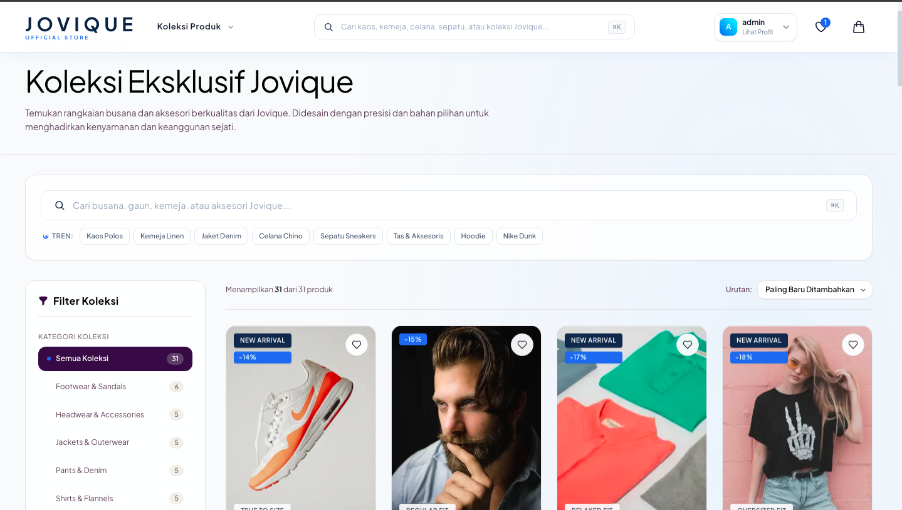
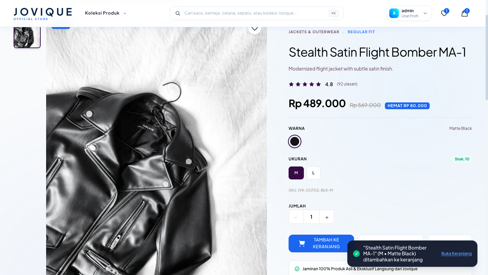
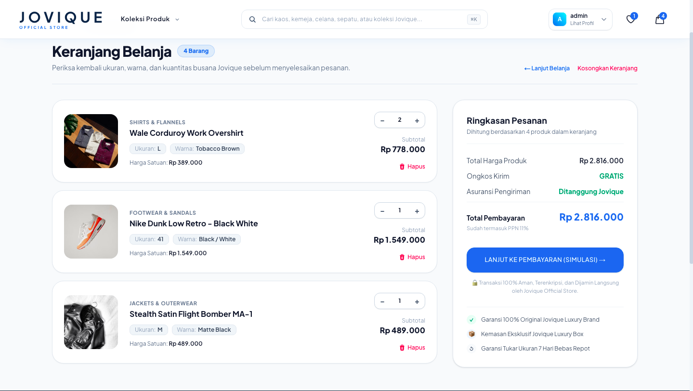
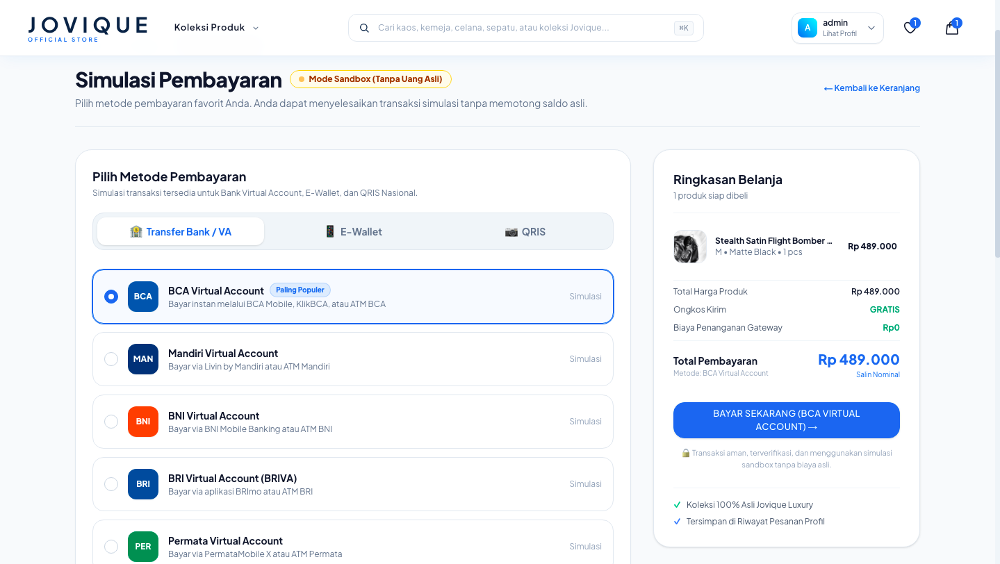

# Jovique — Modern Minimalist Fashion E-Commerce

<div align="center">

<p align="center">
  <strong>A high-performance, single-brand fashion e-commerce platform built with Next.js App Router, Supabase SSR authentication, zero-trust Row Level Security (RLS), and automated Xendit payment checkout.</strong>
</p>

[](https://nextjs.org/)
[](https://react.dev/)
[](https://www.typescriptlang.org/)
[](https://tailwindcss.com/)
[](https://supabase.com/)
[](https://vercel.com/)
[](./LICENSE)

---

### [🚀 Explore Live Demo](https://jovique-official.vercel.app/) &nbsp;·&nbsp; [🐛 Report Issue](https://github.com/Jovan-SW/web_ecomerce/issues) &nbsp;·&nbsp; [✨ Request Feature](https://github.com/Jovan-SW/web_ecomerce/issues/new)

---

</div>

<br />

## 🌟 Visual Showcase

### Desktop Hero Experience
The storefront opens with an editorial-grade hero banner featuring fluid typography, brand storytelling, quick-action discovery CTAs, and a glassmorphic navigation header.

<div align="center">
  
</div>

<br />

### Core Feature Workflows

| Product Catalog & Dynamic Filtering | Product Detail & Variant Selection |
| :---: | :---: |
|  |  |
| *Server-rendered catalog with multi-facet category tabs, price range filters, search, and dynamic sorting.* | *Product detail view featuring high-res lookbooks, size & color selectors, stock awareness, and Schema.org rich snippets.* |
| **Interactive Cart Drawer & Subtotal** | **Checkout Workflow & Payment Gateway** |
|  |  |
| *Client-side state synchronization, real-time quantity modifiers, optimistic subtotal recalculation, and slide-in drawer.* | *Full checkout pipeline integrated with Xendit: Virtual Accounts (BCA, Mandiri, BNI, BRI), E-Wallets, and QRIS.* |

<br />

---

## 🔒 Database Architecture & Zero-Trust Security

Jovique enforces a **Zero-Trust Security Model** at the database layer using PostgreSQL **Row Level Security (RLS)** in Supabase. Rather than relying solely on application-level checks, data access boundaries are mathematically verified by the database engine for every transaction.

### RLS Policies & IDOR Prevention Matrix

To eliminate **Insecure Direct Object References (IDOR)**, user records and operational data are strictly scoped to the cryptographically signed JWT subject (`auth.uid()`).

| Table Name | Operations | Target Role | RLS Policy Expression | Security & IDOR Prevention Implication |
| :--- | :--- | :--- | :--- | :--- |
| `products` | `SELECT` | `anon`, `authenticated` | `true` | Public read access for SEO scrapers and visitors; catalog data is universally accessible. |
| `products` | `INSERT`, `UPDATE`, `DELETE` | `service_role` | `auth.role() = 'service_role'` | Zero client writes permitted. Product inventory and pricing can only be modified via admin backend services. |
| `product_variants` | `SELECT` | `anon`, `authenticated` | `true` | Public inventory visibility (SKU, size, color, stock) for real-time customer decision-making. |
| `categories` / `banners` | `SELECT` | `anon`, `authenticated` | `true` | Public promotional and taxonomy metadata. Write operations restricted to service roles. |
| `profiles` | `SELECT`, `UPDATE` | `authenticated` | `auth.uid() = id` | Strict tenant isolation. Users can only view and update their own identity profile. |
| `carts` | `ALL` (`SELECT`, `INSERT`, `UPDATE`, `DELETE`) | `authenticated` | `auth.uid() = user_id` | **Strict Tenant Isolation**: Prevents unauthorized enumeration or alteration of another user's cart. |
| `wishlists` | `ALL` | `authenticated` | `auth.uid() = user_id` | Individual user wishlists are completely isolated from peer inspection. |
| `orders` | `SELECT`, `INSERT` | `authenticated` | `auth.uid() = user_id` | **Tenant-Level Isolation**: Customers can only query their own historical transactions. Cross-user order tampering is blocked at the SQL engine level. |
| `order_items` | `SELECT` | `authenticated` | `EXISTS (SELECT 1 FROM orders WHERE orders.id = order_items.order_id AND orders.user_id = auth.uid())` | **Relational IDOR Prevention**: A malicious actor cannot query order items by guessing UUIDs; access requires parent order ownership. |

### PostgreSQL Policy Implementation Snippets

#### 1. Tenant Isolation for Orders
```sql
-- Enable Row Level Security
ALTER TABLE public.orders ENABLE ROW LEVEL SECURITY;

-- Customers can only view orders where user_id matches their authenticated session ID
CREATE POLICY "Users can view their own orders"
ON public.orders
FOR SELECT
TO authenticated
USING (auth.uid() = user_id);

-- Customers can only insert orders linked to their own account
CREATE POLICY "Users can create their own orders"
ON public.orders
FOR INSERT
TO authenticated
WITH CHECK (auth.uid() = user_id);
```

#### 2. Relational `EXISTS` Validation for Order Items
```sql
-- Enable Row Level Security
ALTER TABLE public.order_items ENABLE ROW LEVEL SECURITY;

-- Block horizontal privilege escalation on line items
CREATE POLICY "Users can view order items belonging to their orders"
ON public.order_items
FOR SELECT
TO authenticated
USING (
  EXISTS (
    SELECT 1 FROM public.orders
    WHERE public.orders.id = public.order_items.order_id
      AND public.orders.user_id = auth.uid()
  )
);
```

<br />

---

## 🚀 Engineering Decisions & Architectural Highlights

### 1. Server-Side Rendering (SSR) & Dynamic ISR
- **Sub-Second First Contentful Paint (FCP)**: The product catalog and detail pages leverage Server Components with Incremental Static Regeneration (`revalidate = 60`). Data fetching occurs on the server, eliminating client-side loading waterfalls.
- **Search Engine Optimization (SEO)**: Dynamic OpenGraph image graphs, Twitter Card tags, canonical URLs, and structured data via **Google Schema.org (`Product` & `Offer` JSON-LD)** ensure maximum discoverability.

### 2. Cookie-Based Supabase Auth with Next.js SSR
- Integrated using `@supabase/ssr` with native Next.js `cookies()` storage handlers (`getAll()` / `setAll()`).
- Eliminates JWT expiration flicker and ensures server components, route handlers, and client components share a synchronized, secure authentication context.

### 3. Client-Side State Synchronization & Optimistic UI
- **Reactive Cart & Wishlist Providers**: Global state handled through lightweight React Context (`CartContext` and `WishlistContext`).
- **Optimistic Updates**: Item quantities, removals, and drawer toggles update instantaneously with zero perceived network latency.
- **Fault-Tolerant Local Storage Sync**: Automatic local persistence fallback (`jovique_sim_orders_`) prevents cart loss during network drops or unauthenticated guest browsing sessions.

### 4. Enterprise-Grade Checkout & Payment Workflow
- **Xendit Payment Gateway Integration**: Native Next.js server route handlers dispatch authenticated invoice generation requests (`https://api.xendit.co/v2/invoices`).
- Supports multi-channel payments standard in Southeast Asia:
  - **Virtual Accounts**: BCA, Mandiri, BNI, BRI, Permata
  - **E-Wallets**: GoPay, OVO, Dana, ShopeePay
  - **Instant QR**: QRIS (Quick Response Code Indonesian Standard)

### 5. Minimalist Design System & Responsive Layouts
- Handcrafted with **Tailwind CSS v4** and modern glassmorphic tokens (`backdrop-blur-md`, subtle border highlights, ambient atmospheric radial gradients).
- Typography powered by Google Font **Plus Jakarta Sans**.
- Accessible slide-over drawer with automated `document.body` scroll-lock mechanics for mobile devices.

<br />

---

## 🛠️ Categorized Tech Stack

| Domain | Technologies & Libraries | Purpose |
| :--- | :--- | :--- |
| **Core Framework** | [Next.js 16](https://nextjs.org/) (App Router), [React 19](https://react.dev/), [TypeScript 5](https://www.typescriptlang.org/) | Type-safe hybrid SSR/SSG rendering, Server Components, Route Handlers |
| **Styling & Design** | [Tailwind CSS v4](https://tailwindcss.com/), `@tailwindcss/postcss`, Plus Jakarta Sans | Modern utility styling, custom glassmorphism, responsive grid architecture |
| **Backend & Database** | [Supabase](https://supabase.com/), PostgreSQL 14.5 | Cloud relational database, Row Level Security, auto-generated TypeScript schema |
| **Authentication** | `@supabase/ssr`, `@supabase/supabase-js` | Secure cookie-based SSR session management and OAuth/password auth |
| **Payment Gateway** | [Xendit API v2](https://www.xendit.co/) | Automated checkout invoices, Virtual Accounts, E-Wallets, QRIS |
| **Icons & Media** | Custom Inline SVG Icons, Next.js Image Optimization | Zero-dependency footprint, optimized WebP/AVIF asset delivery |
| **Deployment & Hosting** | [Vercel Edge Network](https://vercel.com/) | Edge routing, global CDN caching, automated Git deployments |

<br />

---

## 📂 Repository Directory Structure

```text
web_ecomerce/
├── app/                              # Next.js App Router Architecture
│   ├── api/                          # Server Route Handlers
│   │   ├── orders/route.ts           # Authenticated user orders endpoint
│   │   └── xendit/create-invoice/    # Xendit invoice creation gateway
│   ├── auth/                         # Authentication pages (login, register)
│   ├── cart/                         # Cart review and summary page
│   ├── checkout/                     # Multi-step checkout & payment client
│   ├── products/                     # Product catalog & dynamic slug routes ([slug])
│   ├── profile/                      # User profile & transaction history
│   ├── wishlist/                     # Saved items collection
│   ├── globals.css                   # Tailwind CSS v4 design tokens & base rules
│   ├── layout.tsx                    # Root layout with providers & global metadata
│   ├── robots.ts                     # Search crawler directives
│   └── sitemap.ts                    # Dynamic XML sitemap generation
├── assets/                           # Production UI showcase screenshots
│   ├── hero-banner.png               # Desktop hero showcase
│   ├── product-page.png              # Catalog & filtering view
│   ├── detail-product.png            # Product detail & options view
│   ├── cart-drawer.png               # Cart drawer interface
│   └── payment-method.png            # Checkout payment methods view
├── components/                       # Reusable UI component modules
│   ├── auth/                         # Login & registration forms
│   ├── button/                       # Polymorphic button variants
│   ├── footer/                       # Brand footer with navigation links
│   ├── heroSlider/                   # Interactive promotional banner carousel
│   ├── navbar/                       # Glassmorphic header, search & mobile drawer
│   ├── productCard/                  # Product card with hover states & badges
│   ├── productGrid/                  # Responsive product display grids
│   └── searchBar/                    # Live product search bar
├── context/                          # Global client-side state providers
│   ├── CartContext.tsx               # Cart state, optimistic updates & toasts
│   └── WishlistContext.tsx           # Wishlist persistence & state handlers
├── services/                         # Business logic & Supabase database queries
│   ├── banners.ts                    # Hero banners retrieval
│   ├── cart.ts                       # Cart CRUD database operations
│   ├── categories.ts                 # Product category taxonomy queries
│   ├── orders.ts                     # Order creation & history resolution
│   ├── products.ts                   # Filtered, sorted & paginated catalog queries
│   └── wishlist.ts                   # Wishlist database operations
├── types/                            # Type definitions & Supabase DB schemas
│   └── database.ts                   # Auto-generated database types
├── utils/                            # Shared utilities and client initializers
│   ├── supabase/                     # SSR client & server cookie initializers
│   │   ├── client.ts                 # Browser Supabase client (@supabase/ssr)
│   │   └── server.ts                 # Server Component / Route Handler client
│   └── search.ts                     # Fuzzy keyword normalization & SQL search terms
└── package.json                      # Project dependencies & operational scripts
```

<br />

---

## ⚡ Getting Started & Installation

### Prerequisites

Ensure you have the following installed on your local development machine:
- **Node.js**: `v18.18.0` or `>= v20.0.0`
- **Package Manager**: `npm` (v9+), `pnpm`, or `yarn`
- **Supabase Account**: An active Supabase project with database tables configured
- **Xendit Account**: Xendit dashboard credentials (Sandbox / Production API Keys)

### Quickstart Sequence

```bash
# 1. Clone the repository
git clone https://github.com/Jovan-SW/web_ecomerce.git

# 2. Navigate to project root
cd web_ecomerce

# 3. Install dependencies
npm install

# 4. Configure local environment variables
cp .env.example .env.local

# 5. Launch local development server
npm run dev
```

Visit [http://localhost:3000](http://localhost:3000) in your browser to inspect the application.

### Available Scripts

| Script | Command | Description |
| :--- | :--- | :--- |
| **Development** | `npm run dev` | Launches the Next.js local development server with Turbopack/HMR. |
| **Build** | `npm run build` | Compiles and optimizes the production build bundle. |
| **Production Start** | `npm run start` | Boots the Next.js production server. |
| **Lint** | `npm run lint` | Runs ESLint check across all project files. |
| **Sync DB Types** | `npm run update-types` | Generates type-safe TypeScript interfaces from remote Supabase schema. |

<br />

---

## ⚙️ Environment Variables Reference

Create a `.env.local` file in your project root using the reference table below:

| Variable Name | Required | Environment | Description | Placeholder Example |
| :--- | :---: | :---: | :--- | :--- |
| `NEXT_PUBLIC_SUPABASE_URL` | **Yes** | Client & Server | The REST endpoint URL of your Supabase project instance. | `https://your-project-ref.supabase.co` |
| `NEXT_PUBLIC_SUPABASE_ANON_KEY` | **Yes** | Client & Server | The public anonymous JWT key for safe client-side queries verified by RLS. | `your_anon_key_here` |
| `NEXT_PUBLIC_SITE_URL` | Optional | Client & Server | Base URL used for canonical link generation, OpenGraph metadata, and sitemaps. | `https://jovique-official.vercel.app` |
| `XENDIT_SECRET_KEY` | **Yes** | Server Only | Secret API key used by server route handlers to create checkout invoices. | `xnd_development_your_secret_key_here` |
| `XENDIT_WEBHOOK_VERIFICATION_TOKEN` | Optional | Server Only | Verification token to authenticate inbound webhook callbacks from Xendit. | `your_webhook_verification_token` |

> [!CAUTION]
> Never commit `.env` or `.env.local` containing live API keys or production secrets to version control. Always verify that `.env*.local` is listed in your `.gitignore`.

<br />

---

## 📄 License & Attribution

Distributed under the **MIT License**. See [`LICENSE`](./LICENSE) for detailed terms.

### Author

**Jovan Sebastian William**
- GitHub: [@Jovan-SW](https://github.com/Jovan-SW)
- Repository: [web_ecomerce](https://github.com/Jovan-SW/web_ecomerce)
- Live Production: [jovique-official.vercel.app](https://jovique-official.vercel.app/)
- LinkedIn: [Jovan Sebastian William](https://linkedin.com/in/)
- Email: jovsebwil723@gmail.com

---

<div align="center">
  <sub>Crafted with passion for minimalist design and robust software engineering. © Jovique Official Store.</sub>
</div>
